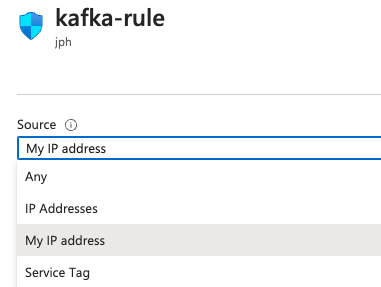

# tfmodule-azure-redis-enterprise

This github uses anisble and terraform to create a full redis cluster of a specified number of nodes.  Optionally, additional one node tiers are available:  cassandra, ubuntu application node, and kafka node.

## Prerequisites 

* [azure-cli](https://docs.microsoft.com/en-us/cli/azure/install-azure-cli-apt?view=azure-cli-latest)
* [tfenv](https://github.com/tfutils/tfenv)

## Initialize Azure Credentials

```BASH
az login
```

## Links
[installing, configuring, running confluent platform](https://docs.confluent.io/platform/current/installation/installing_cp/deb-ubuntu.html)

## Module usage (Basic)

Public Azure Instance and Network setup.  Note the count variables:

* node-count:       number of redis nodes (3 is most common)
* cassandra-count:  number of cassandra nodes (really just 1 or 0)
* tester-count:     number of application node (really just 1 or 0)

To allow access from local PC instigating the terraform/ansible, set the my-ip variable.  This allows connectivity to redis and cassandra ports from the instigating laptop IP address.  Easiest way to get this Azure public IP address is using the Azure portal.  Go to an existing security rule in the portal and use the *My IP address* option to see local desktop IP address to put in to the my-ip variable.


## Module usage (More advanced)

```
module "azure-redis-enterprise" {
  source       = "git@github.com:Redislabs-Solution-Architects/tfmodule-azure-redis-enterprise.git"
  cluster-name = "terraform-test-1.azure.example.com"
  location     = "uswest2"
  common-tags = {
    Owner       = "Ken_Watanabe@example.com",
    Config      = "terraform",
    Environment = "tf-test"
  }
}

```

From the `test` folder, update the `main.tf` file with the correct parameters for your environment.

Run
```bash
terraform init
```

```bash
terraform plan
```

```bash
terraform apply
```

## Check out what is there

node addresses for cassandra and kafka, as well as the redis endpoints and passord are dumped as appropriately named text files in the directory [provisioners/temp](provisioners/temp)
### kafka node
Check out the kafka control panel by substituting the localhost with the ip found in [kafka_external_ip.txt]((provisioners/temp/kafka_external_ip.txt) at http://localhost:9021
### cassandra
```bash
export CQLSH_HOST=<public ip from cassandra_external_ip.txt>
cqlsh
```

### redis
```bash
redis-cli -h <redis_external_endpoint.txt> -p <redis_port.txt> -a jasonrocks
6077) "pageviews:27061"
6078) "pageviews:65441"
6079) "pageviews:60781"
6080) "pageviews:3191"
6081) "pageviews:36801"
6082) "pageviews:33691"
6083) "pageviews:7971"
6084) "pageviews:24301"
6085) "pageviews:35591"
NOTE:  if this isn't working verify the redis connection is to the internal connection point in the kafka interface as sometimes the connection points can be reversed
Check this in the kafka connectors redis-sink-json definition
> describe keyspaces;
pageviews  system_auth         system_schema  system_views
system     system_distributed  system_traces  system_virtual_schema

> select * from pageviews.views;
viewtime | pageid  | userid
----------+---------+--------
     2511 | Page_62 | User_5
    15061 | Page_28 | User_5
      631 | Page_28 | User_3
     2991 | Page_21 | User_1
    19261 | Page_30 | User_7
    12151 | Page_51 | User_2
    17861 | Page_58 | User_9
    19121 | Page_30 | User_6
     4641 | Page_66 | User_2
    20151 | Page_19 | User_8
      151 | Page_50 | User_3
    11191 | Page_32 | User_3
    14221 | Page_68 | User_3
```

To tear it all down:
```bash
terraform destroy
```
